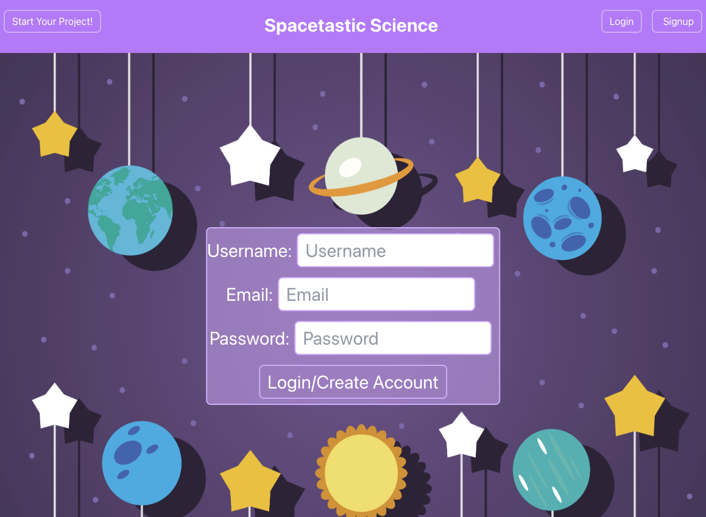

# Science Project Search and Builder

## Description

The Science Project Search and Builder is an interactive MERN Stack Single-Page Application. The application utilizes a React front end that works cooperatively with a MongoDB and Mongoose ODM database, and a GraphQL, API, Express.js, and Node.js server.  

## Table of Contents

- [Description](#description)
- [Usage](#usage)
- [Credits](#credits)
- [Deployed Site](#deployed-site)

## Usage

New users should visit the deployed site to register for an account. Once they have registered for an account, they will be redirected to their "Projects" page and have access to the log into the site on future dates without the need to register again. Once on the "Projects" page, uses will be able to view information about planets, make notes about the populated planet information, give their notes a project title, and then save their project for future use.     

## Credits
 
Collaborators: [Sada Pan-Nord, ](https://github.com/sadapannord) [Yessenia Vieyra, ](https://github.com/Yvieyra) [Hannah Edwards, ](https://github.com/hannahedwards) [Amanda Paul, and ](https://github.com/MuchMuchierCoding) [Nathan Wood](https://github.com/na-br-wo)
 
## Page Preview

## Deployed Site

[Science Project Builder]()